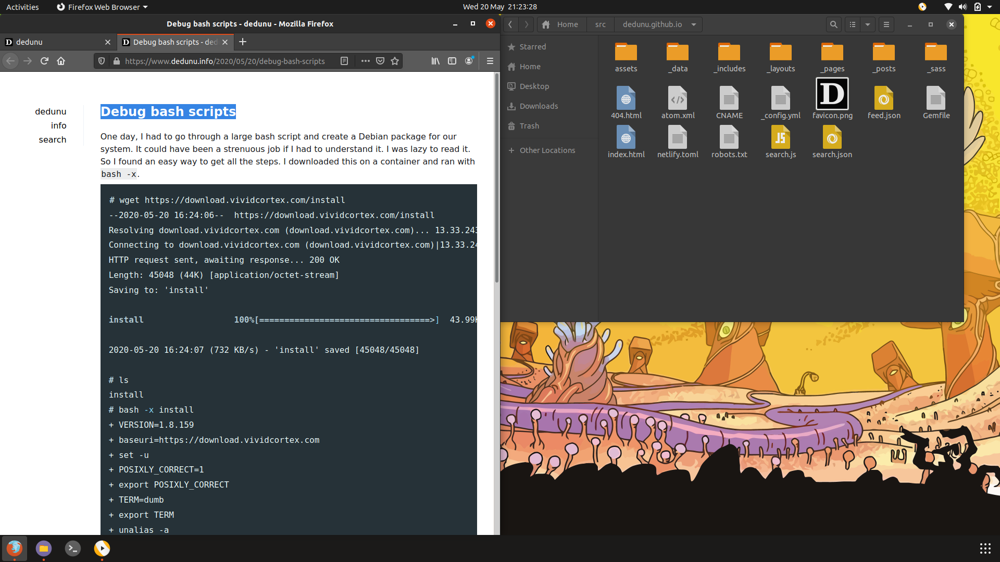
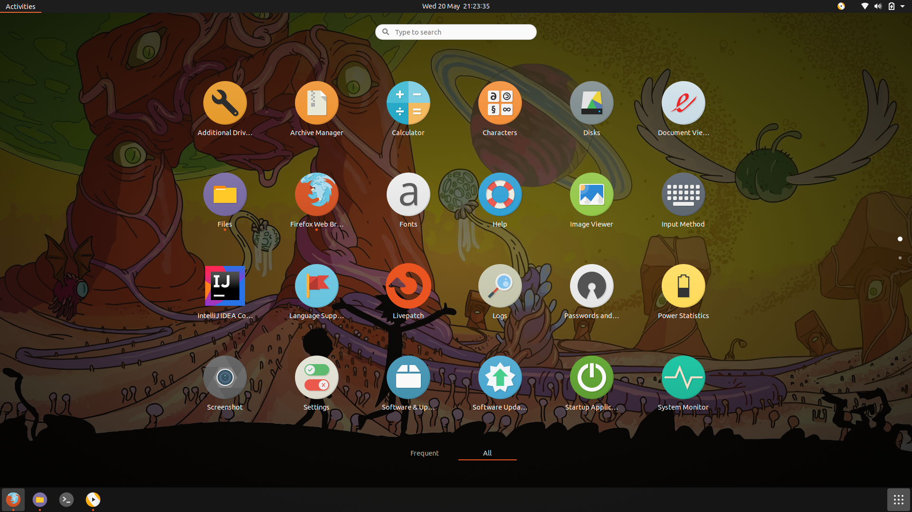
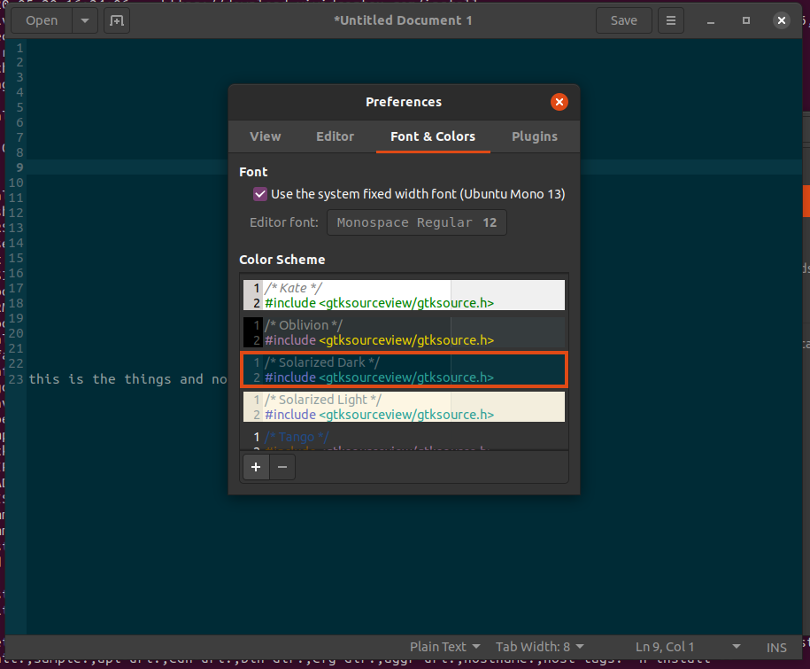

I bought a laptop recently. [HP 14 A4 8GB 256GB SSD](https://www.klick.ee/sulearvuti-hp-14-2019-a4-8gb-256gb). It came with Windows 10 and was bundled with so many applications, I didn't want to use. I tried to install it via PXE. But I couldn't get that working. Finally, I decided to buy a USB drive and install Ubuntu. 

I have to start with the installation. Ubuntu Desktop version has a minimal option. I would say that it is a brilliant option. It doesn't bundle office or anything else I don't want to use. If I want I can download them always. Ubuntu 20.04 has a lovely OEM splash screen. I usually turn off Plymouth, but I decided to leave it on just to see the beautiful OEM logo.

I installed Numix icons which is part of the main repository which is great again. Widely used applications are included in the main repository. I hate adding new repositories because it slows-down `apt update`. I heard in a podcast that even Canonical is annoyed by PPAs.

I like the dark theme. So I didn't install the Numix dark theme. But you might need to change the color scheme in the text editor if you switch to dark mode.

Overall I love Ubuntu! (Even though I use a Mac at work) Things have gotten much better and it is quite fun to use. Try the new version and spread the word!

### Tags

- linux
- ubuntu
- laptop