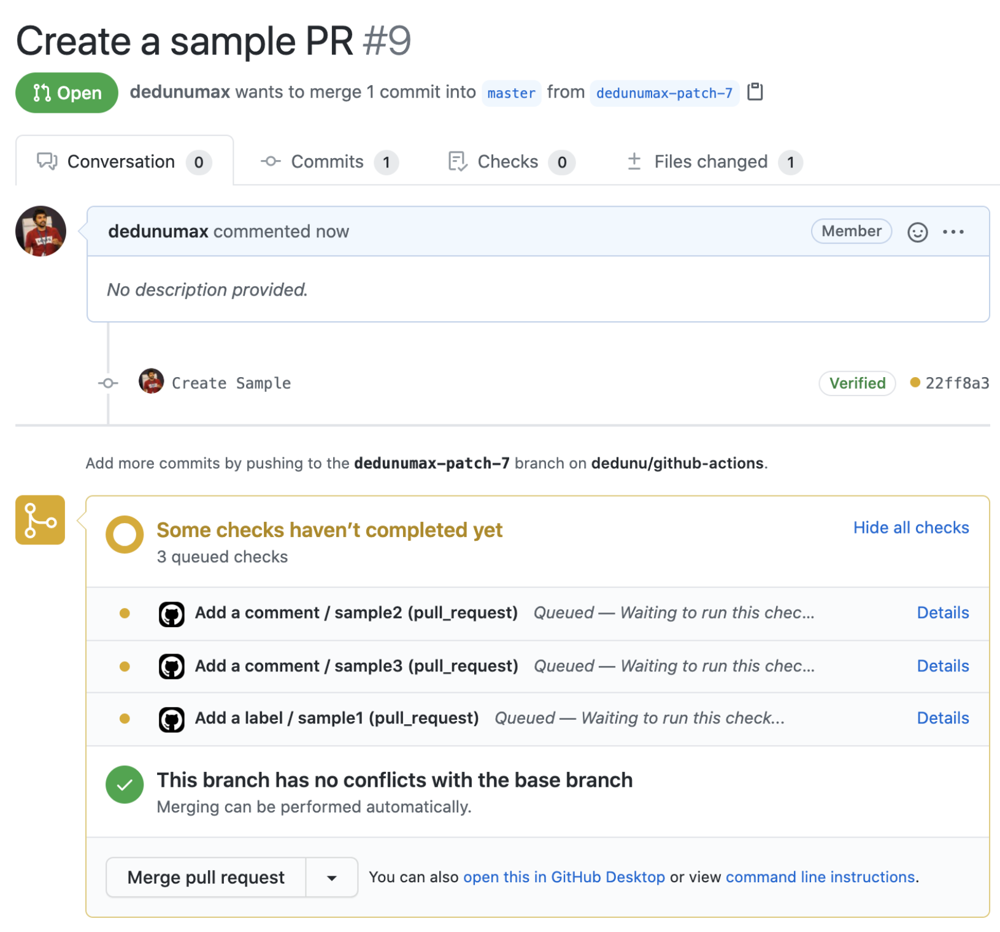
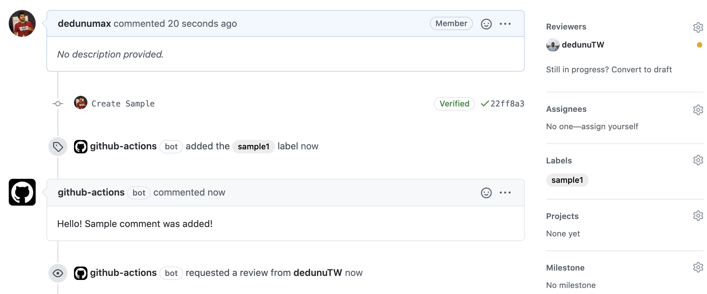
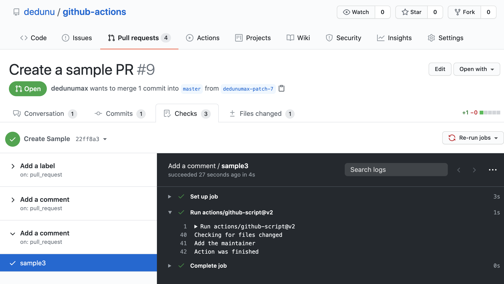

Using 3rd party Github actions on your projects can be dangerous. Tags can be changed afterward.[1] It might be time-consuming to go through a published action that might take more time. Even if you write custom actions yourself, in a separate repository, you need to publish them in a public repository, for now, to use in a workflow.

Workaround for all these concerns is writing in-line actions using `@actions/github-script`. Sometimes it is easy to write in-line actions is easier than using generic 3rd party actions.

Adding a label can be done with below workflow definition. 

```yaml
name: Add a label
on:
  pull_request:
    branches: [ master ]
jobs:
  sample1:
    runs-on: ubuntu-latest
    steps:
    - uses: actions/github-script@v2
      with:
        github-token: ${{secrets.GITHUB_TOKEN}}
        script: |          
          await github.issues.addLabels({
            owner: context.repo.owner,
            repo: context.repo.repo,
            issue_number: context.issue.number,
            labels: ["sample1"],
          });
```

Adding a comment on the pull request can be done with below code. Sample workflow can be found here - <https://github.com/dedunu/github-actions/blob/master/.github/workflows/sample2.yml>

```javascript
await github.issues.createComment({
  issue_number: context.issue.number,
  owner: context.repo.owner,
  repo: context.repo.repo,
  body: "Hello! Sample comment was added!"
});
```

You can define more tasks using same method. Below example would check for files changed. If `sample` text was found in the pull request it will add a reviewer.

```yaml
name: Add a comment
on:
  pull_request:
    branches: [ master ]
jobs:
  sample3:
    runs-on: ubuntu-latest
    steps:
    - uses: actions/github-script@v2
      with:
        maintainer: dedunuTW
        github-token: ${{secrets.GITHUB_TOKEN}}
        script: |
          console.log("Checking for files changed")
          
          const {
            data: listOfFilesChanged
          } = await github.pulls.listFiles({
            owner: context.repo.owner,
            repo: context.repo.repo,
            pull_number: context.issue.number
          });
          
          let ruleFlag = false;
          
          listOfFilesChanged.forEach(file => {
            result = file.patch.match(/sample/g);
            if (result !== null && result.length > 0) {
              ruleFlag = true;
            }
           });
              
           if (ruleFlag) {
            console.log("Add the maintainer")
            let maintainer = core.getInput('maintainer')
            await github.pulls.createReviewRequest({
              owner: context.repo.owner,
              repo: context.repo.repo,
              pull_number: context.issue.number,
              reviewers: [maintainer],
            });
           }
           
           console.log("Action was finished");
```

Sample repository - <https://github.com/dedunu/github-actions>

Actions in action - <https://github.com/dedunu/github-actions/pull/9>

When you create pull requests, you can see the workflows starting.



You can see it added a label, comment, and reviewer.



Logs can be found in the checks section. Logging helps you to debug actions. Be careful not to print GITHUB_TOKEN!



API documentation can be found here - <https://octokit.github.io/rest.js/v18>

[1] - <https://julienrenaux.fr/2019/12/20/github-actions-security-risk/> 

### Tags

- github
- actions
- security