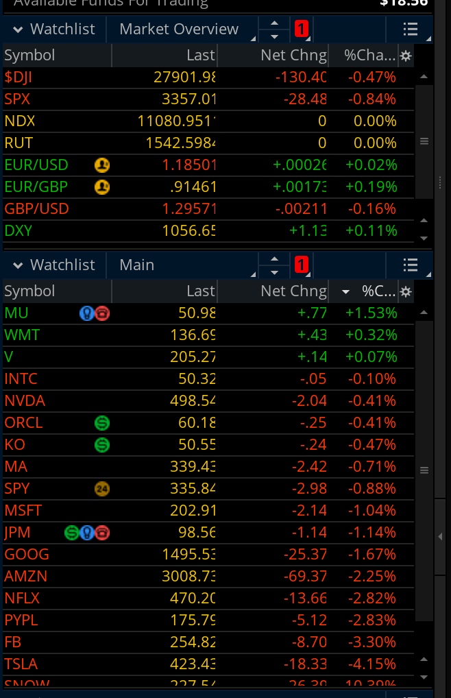
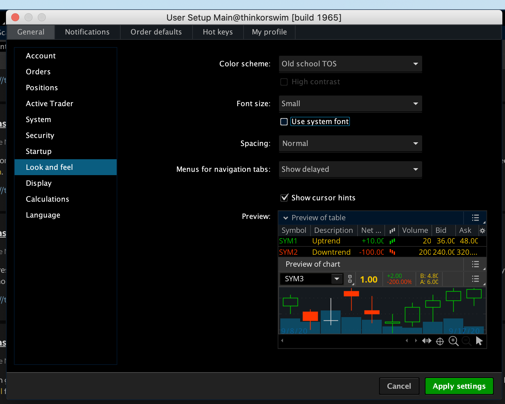
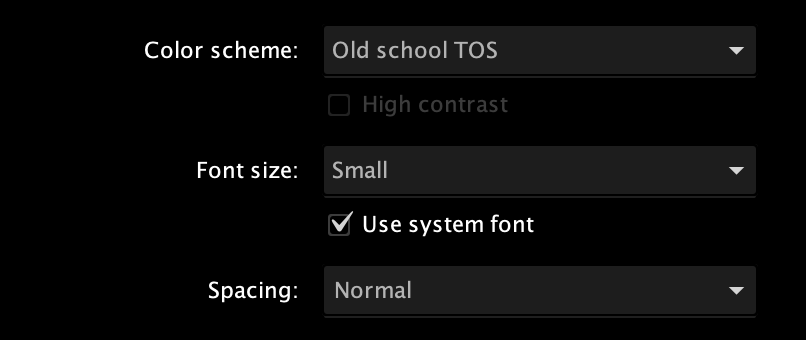
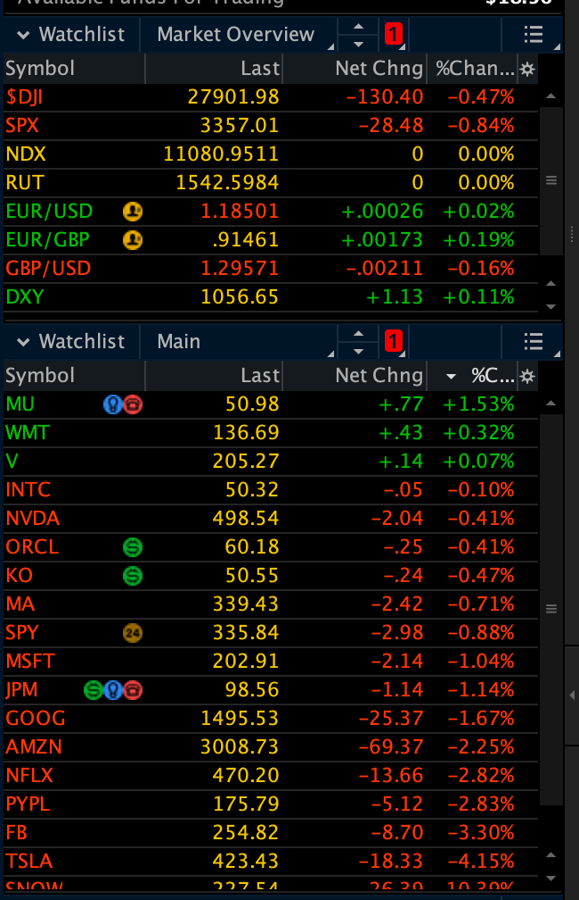

I love thinkorswim platform. It is really great to go through the market data and fundamentals. Recently, thinkorswim had an issue on displaying decimal places. It looked like below.

It can be fixed by changing font settings. Click `Setup` -> `Application Settings` on the right top corner. Click on the `Look and Feel`.

Then tick the `Use system font`. Click `Apply Settings`

After that it looked like this.

### Tags

- tdameritrade
- mac
- thinkorswim
- osx